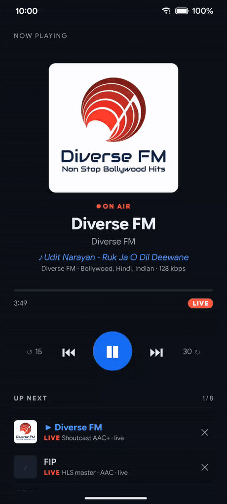

# rn-media

[](https://github.com/afkcodes/rn-media/actions/workflows/android-build.yml)
[](https://github.com/afkcodes/rn-media/actions/workflows/ios-build.yml)
[](LICENSE)
[](#requirements)

**React Native audio playback built on [libmpv](https://mpv.io), with a
player-agnostic media-session layer** — lock screen, notification, Bluetooth
and background playback that keep working after the app's UI is gone.

Three independent packages, no cross-dependencies: a libmpv player, an
audio-focus arbiter, and a media session that drives lock screens for *any*
player. Powered by [Nitro Modules](https://nitro.margelo.com) — the C++ core
binds libmpv's client API directly, no bridge layer. Lineage: Flutter's
[`audio_service`](https://pub.dev/packages/audio_service) /
[`audio_session`](https://pub.dev/packages/audio_session) / media-kit trio.

> **Status: v0.1, pre-release.** The Android stack is verified end-to-end on a
> physical device: audio output, notification controls round-tripping to JS,
> playback surviving Activity destruction, and the whole session coming back
> from a process the OS had killed. iOS is **built by CI** — it compiles, links
> and embeds the libmpv frameworks — but has never run on a device. APIs may
> still change.

<p align="center">
  
</p>

<p align="center">
  <sub><a href="apps/example">The example app</a>, on a physical Android 16 device — live Shoutcast with
  artwork and ICY now-playing → notification shade → lock screen, whose play
  button drives the same handler → seek on a finite AAC/MP4 track → EQ preset →
  stop and dismiss. <a href="docs/assets/demo.mp4">Source video</a>.</sub>
</p>

## Why this exists

| | react-native-track-player | react-native-video / expo-video | **rn-media** |
|---|---|---|---|
| Engine | ExoPlayer / AVPlayer | ExoPlayer / AVPlayer | **libmpv (ffmpeg)** |
| Formats | Platform codecs | Platform codecs | Everything ffmpeg decodes — MP3, AAC/M4A, FLAC, OGG/Opus, HLS, ICY/Icecast, and more |
| Multiple players | ❌ singleton | ✅ | ✅ |
| Background + media session | ✅ best-in-class | ⚠️ basic | ✅ media3 `MediaLibraryService`, native-first commands |
| Session layer works with *any* player | ❌ | ❌ | ✅ (`@rn-media/media-session` is player-agnostic) |
| Gapless playlists | ⚠️ | ❌ | ✅ (mpv native) |
| EQ / DSP | ❌ | ❌ | ✅ 16 ffmpeg filters, 22 tuned EQ presets |
| DRM (Widevine/FairPlay) | ❌ | ✅ | ❌ (libmpv cannot — see [Limitations](#limitations)) |

The sweet spot: music apps with **non-DRM audio** — indie catalogs, self-hosted
libraries (Plex / Jellyfin / Subsonic), podcasts, radio, audiobooks.

Different job? [`react-native-audio-api`](https://github.com/software-mansion/react-native-audio-api)
implements the **Web Audio API** — an audio *graph* for synthesis, games and
per-sample DSP. That's a paradigm this library doesn't attempt, and the reverse
holds for queues, lock screens and background survival. They compose, though:
`@rn-media/media-session` takes any player structurally, so a Web-Audio app can
drive our lock-screen and background layer.

## 60-second quick start

```sh
npm install @rn-media/player @rn-media/audio-session @rn-media/media-session react-native-nitro-modules
cd ios && pod install   # downloads + verifies the pinned libmpv xcframeworks
```

```tsx
import { Button, Text, View } from 'react-native';
import { usePlayer, useProgress } from '@rn-media/player';

export function MiniPlayer() {
  // Created on mount, destroyed on unmount.
  const { player } = usePlayer({ setup: p => p.load('https://cdn.example/t.flac') });
  const { position, duration, isLive } = useProgress(player);

  return (
    <View>
      <Button title="Play / Pause" onPress={() => player?.toggle()} />
      <Text>{position.toFixed(0)}s {isLive ? '· live' : `/ ${duration?.toFixed(0)}s`}</Text>
    </View>
  );
}
```

That is a working player: [platform setup](#platform-setup) is one `Info.plist`
key on iOS and nothing at all on Android.

## The mental model

```
            your app UI ─────────────┐
                                     ▼ (renders from the same broadcasts)
┌────────────────────────────────────────────────────────────────────┐
│ @rn-media/media-session   fan-in:  notification · lock screen ·    │
│                                    Bluetooth · watch → ONE handler │
│                           fan-out: playbackState · mediaItem ·     │
│                                    queue — the only state source   │
├────────────────────────────────────────────────────────────────────┤
│ @rn-media/audio-session   focus · AVAudioSession · interruptions   │
├────────────────────────────────────────────────────────────────────┤
│ @rn-media/player          TS Player (state reducer, hooks)         │
│   └─ Nitro pure-C++ HybridObject ── libmpv (one core per player)   │
└────────────────────────────────────────────────────────────────────┘
```

Use `player` alone for foreground playback; add `audio-session` for focus; add
`media-session` for lock screen and background. Both session packages accept
**any** engine — the contracts are structural, not nominal, so RNTP,
`expo-audio` or a TTS engine fit them unchanged.

Two rules the whole design rests on, and you will feel both. **Position is an
anchor, never a stream**: state carries `{ value, at, rate }`, updated only on
discontinuities, and every surface projects `value + elapsed × rate` locally —
the lock-screen scrubber moves with zero bridge traffic. **Commands are
native-first**: the notification's pause button acts on the native state machine
immediately, and your JS handler is notified after, never on the critical path.

## Play something

```ts
import { Player } from '@rn-media/player';

const player = await Player.create({ volume: 0.8, cacheSecs: 60 });
await player.loadPlaylist([a, b, c], { startIndex: 0 }); // gapless, one mpv playlist
player.play();

player.on('trackChanged', ({ index }) => console.log('now on', index));
player.on('trackEnded', () => console.log('finished naturally'));
player.on('error', e => console.log(e.code, e.message)); // network | unsupported-format | …

// --- the rest of the surface, at a glance ---
player.pause(); player.toggle();
await player.seekTo(90);
player.setRate(1.5);           // pitch-corrected
player.setVolume(0.5);         // 0..1
player.setLoop('playlist');    // 'off' | 'track' | 'playlist'

await player.playlist.add(uri);                       // to the end
await player.playlist.add(uri, { position: 'next' }); // play it after this one
await player.playlist.add(uri, { position: 0 });      // exact index; rejected if out of range
await player.playlist.move(0, 4);
await player.playlist.jumpTo(2);  // plays it; { autoPlay: false } to stay paused
await player.playlist.shuffle();  // mpv playlist-shuffle; unshuffle() undoes it, once

const snapshot = player.state;    // status, playing, duration, isLive, title, …
player.onStateChange(state => render(state));  // only on real changes
player.getPosition();             // projected locally — no bridge traffic, no timers
player.getMetadata();             // typed tags, ICY now-playing included
player.destroy();                 // when you are done with the core
```

Worth knowing:

- **Multiple players are first-class** — each is its own mpv core, so a
  crossfade deck or a preview player is just a second `Player.create()`.
- **Live streams are honest**: `isLive: true` and `duration: undefined`. mpv's
  perpetually-growing cache length is suppressed, not broadcast as a duration.
- **HLS works on both platforms** — our libmpv pins add the `hls` and `mpegts`
  demuxers that stock audio builds omit — as do HTTPS files and ICY/Icecast.
  `.m3u8`/`.m3u` loads force `demuxer=lavf`, so mpv's playlist demuxer cannot
  explode your queue with segment entries.
- **Metadata is a pull plus an event**: `getMetadata()` /
  `getMetadataValue('icy-title')` walk mpv's typed tag list (no string parsing),
  and `metadataChanged` fires at most once per native event batch — which is how
  ICY now-playing arrives on a radio stream.
- **Gapless is the audio device staying open**, not a crossfade: a queue is one
  mpv playlist, and consecutive entries hand over in ~25 ms with the device
  never reopened (measured on-device, release build). `gaplessAudio` picks how
  hard to try when consecutive tracks decode to *different* formats.
- `prefetchPlaylist: true` opens the next entry early — on a network queue that
  is what keeps the handover gapless (measured: 644 ms and an audible underrun
  without it, 25 ms and none with it). `cacheSecs` bounds mpv's readahead (30 s
  by default, against mpv's ~1000 hours); `userAgent` defaults to
  `rn-media (libmpv)` because real Shoutcast hosts 401 the literal `libmpv`.

Queue semantics, shuffle's one-level undo, ReplayGain, prefetch caveats, the
typed error taxonomy: [`@rn-media/player` README](packages/player/README.md).

## Show it on the lock screen

Every command surface — notification, lock screen, Bluetooth, headset, watch —
funnels into **one handler you implement**. You broadcast state on three channels,
and every surface, including your own UI, renders from them.

```ts
import { BaseMediaHandler, MediaService } from '@rn-media/media-session';

class PlaybackHandler extends BaseMediaHandler {
  override async play() { player.play(); }
  override async pause() { player.pause(); }
  override async seekTo(ms: number) { await player.seekTo(ms / 1000); }
  override async skipToNext() { await player.playlist.next(); }
  override async skipToPrevious() { await player.playlist.previous(); }
  override async stop() { player.pause(); await service.stopService(); }
  // onTaskRemoved, customAction, onSleepTimer, onPlaybackResumption: all defaulted.
}

const service = await MediaService.init(() => new PlaybackHandler(), {
  android: {
    notificationChannelId: 'playback',
    notificationChannelName: 'Playback',
    notificationIcon: 'ic_notification', // a drawable in YOUR app
  },
});
```

Then broadcast, typically straight from `player.onStateChange`:

```ts
service.setQueue(tracks.map(t => ({ id: t.id, title: t.title, artist: t.artist })));
service.setMediaItem({
  id: track.id, title: track.title, artist: track.artist, artworkUri: track.art,
  duration: track.durationMs, // omit for live — a missing duration IS the live flag
});

player.onStateChange(state => {
  service.setPlaybackState({
    status: state.playing ? 'playing' : 'paused',
    position: {
      value: player.getPosition() * 1000, at: Date.now(),
      rate: state.playing ? state.rate : 0, // 0 freezes every surface's projection
    },
    controls: ['skipToPrevious', 'pause', 'skipToNext'],
    capabilities: ['play', 'pause', 'seek', 'skipToNext', 'skipToPrevious'],
    queueIndex: state.playlist.index,
  });
});
```

`controls` are the buttons you want, in order; `capabilities` are the commands
your handler will actually service (media3 never invokes a handler for a command
you did not declare). `QueueHandler` supplies default `skipToNext` /
`skipToPrevious` / `skipToQueueItem` arithmetic over the broadcast queue, and
`CompositeMediaHandler` decorates a handler (analytics, logging) without
touching it:
[reference](packages/media-session/README.md#controls-vs-capabilities).

## Handle focus and headphones

Duck for navigation prompts, pause for phone calls, resume after, pause when
the headphones come out — one call:

```ts
import { AudioSessionPresets, wireAudioSession } from '@rn-media/audio-session';

const unwire = wireAudioSession(player, {
  preset: AudioSessionPresets.music, // or .speech — pauses instead of ducking
  duckVolume: 0.3,
  resumeAfterInterruption: true,
});
```

`wireAudioSession` takes anything with `{ play, pause, setVolume, getVolume }`,
so it is not coupled to our `Player`; activating the session before `play()`
stays the app's job. Everything under the helper —
`AudioSession.configure/activate/deactivate` and the `interruption`,
`becomingNoisy` and `routeChange` listeners — is public when you want the policy
yourself: [reference](packages/audio-session/README.md#player-integration).

## Survive backgrounding and process death

On Android the media3 foreground service keeps the process — and with it the JS
runtime — alive, so your handlers keep working with the Activity destroyed. But
**a paused service is eventually demoted, and a demoted service is killable**.
media3 holds it foreground for a grace period first (10 minutes by default;
`android.stopForegroundTimeoutMs` moves it, `0` demotes at once). When Android
reclaims the process, the queue, track and position must live somewhere else.

```ts
import {
  MediaService, applyPersisted, restorePersisted, withPersistence,
} from '@rn-media/media-session';

// Saves on every broadcast. `storage` is anything with { getItem, setItem }:
// AsyncStorage, MMKV, your own — this package depends on none of them.
const service = withPersistence(
  await MediaService.init(() => new PlaybackHandler(), config),
  storage,
);

// Next launch:
const restored = await restorePersisted(storage);
if (restored.status === 'restored') applyPersisted(service, restored.session);
```

Writes happen on broadcasts, and broadcasts are discontinuity-only — so a track
played straight through saves nothing until you say so. `service.save()`
re-projects the anchor and writes on demand, with no broadcast; you pick the
moment (`AppState` leaving `active`, `onTaskRemoved`, before `stopService`).
The position always comes back **paused**: a saved anchor with a live rate
would claim a position that grew while the process was dead, and on Android a
`playing` broadcast is precisely what starts a foreground service.

**JS timers freeze in the background** (an RN platform behaviour — handlers,
promises and network callbacks work; `setTimeout` does not). So the sleep timer
is a library feature rather than something you build: `setSleepTimer(seconds)` /
`getSleepTimerRemaining()` / `cancelSleepTimer()`, running on a native
`Handler` / `DispatchQueue` timer. When it fires, playback is paused **natively
first** — the same path a notification pause takes — and only then is
`onSleepTimer` called on your handler. Verified on-device with the Activity
destroyed.

### Coming back from the dead (Android)

Android can bring the whole thing back after the process is gone — System UI's
resumption card, a Bluetooth reconnect, a headset play button. Opt-in, because it
starts a foreground service in a process the user did not open.

```ts
import type { MediaServiceConfig } from '@rn-media/media-session';

// The same withPersistence(await MediaService.init(…)) as above, plus one flag:
const config: MediaServiceConfig = {
  android: {
    notificationChannelId: 'playback',
    notificationChannelName: 'Playback',
    playbackResumption: true, // default false
  },
};
```

Three things must line up, and the library logs which one is missing: that flag,
`withPersistence` (it writes the snapshot the service reads), and
`MediaService.init` at module scope (below) — plus media3's `MediaButtonReceiver`
declared in your own `AndroidManifest.xml`, a deliberate copy-paste since it
changes media-button routing for the whole app.

The service rebuilds the session from a **native** mirror of the persisted
snapshot — no JavaScript involved — posts the notification with the right track
inside the foreground-service deadline, and *then* boots your runtime behind it;
the `play` the user pressed is replayed on your handler once it arrives.
Measured from a killed process: notification up 59 ms after the OS granted the
start, audio playing from the persisted position at 377 ms.

The requirement that catches everybody: **`MediaService.init(...)` must be
reachable at JS module scope**, not inside a component or a hook. A revived
runtime loads your bundle and mounts nothing, so an `init` in a `useEffect`
never runs — the library waits 10 s, logs exactly that, and stops the service.
[`apps/example/App.tsx`](apps/example/App.tsx) does it the right way.

**Where iOS fits.** Persistence is identical on both platforms; only the
*consumer* differs. Android's OS reads the record automatically; on iOS the user
does, by launching the app, and the restore puts them back on the same track and
position, paused. There is no iOS twin of `playbackResumption` and there cannot
be one — a terminated iOS app stays terminated. Platform policy, not a gap.

The full story, including the honest edges:
[persistence](packages/media-session/README.md#surviving-process-death-withpersistence)
· [resumption](packages/media-session/README.md#playback-resumption-after-process-death)
· [sleep timer](packages/media-session/README.md#sleep-timer-native)
· [foreground-service lifecycle](packages/media-session/README.md#android).

## Shape the sound

`setAudioFilters` compiles typed descriptors into mpv's own `af` grammar. Our
libmpv builds carry the same 16 LGPL audio filters on **both** platforms, so
nothing here needs a platform branch.

```ts
import { AudioFilters, EQUALIZER_PRESETS, equalizerPresetChain } from '@rn-media/player';

// 22 tuned 10-band presets (EQUALIZER_PRESET_LIST is picker-ordered), each with
// a pre-amp computed from the summed response, so a preset cannot clip.
player.setAudioFilters(equalizerPresetChain(EQUALIZER_PRESETS.rock));

// Or by hand: parametric bands, shelves, an 18-band FFT EQ, crossfeed,
// compressor, limiter, dynamic normaliser, loudnorm, volume.
player.setAudioFilters([
  AudioFilters.equalizer({ frequency: 60, widthType: 'o', width: 1, gain: 4 }),
  AudioFilters.crossfeed({ strength: 0.3 }),
  AudioFilters.limiter(),
]);
player.clearAudioFilters();

// Volume-domain loudness normalisation — independent of the filter chain.
player.setReplayGain({ mode: 'album', preamp: -3, fallback: -6 });
```

Filters, playback speed and ReplayGain never interact: mpv's speed handling sits
downstream of the user chain, and ReplayGain is volume-domain.
`defineEqualizerPreset` validates a user-designed curve; `AudioFilters.custom`
reaches any ffmpeg audio filter that is compiled in. Factory list, preset
mechanics, availability probe:
[filters and EQ](packages/player/README.md#audio-filters-and-eq) ·
[ReplayGain](packages/player/README.md#replaygain-loudness-normalisation).

## See the sound

A live spectrum of exactly this player's output, on **both platforms**, with no
permission to request and nothing to add to your manifest:

```tsx
const { frame, error } = useVisualizer(player, { bands: 28 });
// frame.bands — Float32Array in [0, 1], log-spaced and already smoothed
```

The samples come from mpv itself: our libmpv forks carry a small source patch
that exposes the audio the engine is handing to the device (`pcm-tap`,
`pcm-tap-frame`), tapped after the filter chain and after mpv's software gain —
so what you draw is what you hear, EQ and all. A native sampler thread
downmixes, windows and transforms it; the PCM never crosses into JavaScript and
only ~4 KB of spectrum does. Lazy end to end: nothing exists until something
subscribes, and the last unsubscribe frees all of it.

It needs binaries carrying that patch (Android `v1.1.9-rnmedia.3`+, iOS
`v0.7.2-rnmedia.3`+ — what this repo pins). On anything older
`player.visualizer.capabilities.fft` is `false` and subscribing throws a typed
`unsupported` error rather than doing nothing quietly. Full contract:
[visualizer](packages/player/README.md#visualizer-spectrum--waveform).

## Reach into mpv

The C++ binding is a complete, raw mpv client and the typed `Player` is TS on
top of it — so anything mpv can do, you can do, without waiting for us:

```ts
await player.command(['loadfile', uri, 'append-play']);
player.setPropertyString('af', 'loudnorm'); // any mpv option or filter string
player.observeProperty('demuxer-cache-time', 'number'); // arrives as a typed event
player.getPropertyNumber('demuxer-cache-duration');
player.getRawHandle(); // the mpv_handle, reserved for the future video plugin
```

`createMpvClient()` hands you the binding with no `Player` wrapper at all.

## Platform setup

**Android** — nothing to configure. The `media-session` library manifest merges
the foreground-service permissions and the `mediaPlayback` service into your
app. `POST_NOTIFICATIONS` is *not* required for media notifications.

**iOS** — add the background audio mode to `Info.plist`:

```xml
<key>UIBackgroundModes</key>
<array><string>audio</string></array>
```

**Expo** — works with the prebuild (managed) workflow, no manual native edits.
`@rn-media/media-session` ships the config plugin for the whole library; the
other two packages need none.

```json
{ "expo": { "plugins": ["@rn-media/media-session"] } }
```

```sh
npx expo prebuild --clean
npx expo run:android   # or run:ios, or an EAS build
```

It merges `UIBackgroundModes: audio` into `Info.plist` idempotently (a sibling
mode like `voip` survives); Android needs nothing. Its one option installs the
notification drawable — `["@rn-media/media-session", { "androidNotificationIcon":
"./assets/ic_notification.xml" }]` — the only way a prebuild app can add one,
since `android/` is regenerated. Expo Go cannot load this library; use a
development build. [Plugin reference](packages/media-session/README.md#expo-config-plugin).

## Requirements

- React Native **>= 0.82** (New Architecture; developed against 0.86)
- [`react-native-nitro-modules`](https://nitro.margelo.com)
- Android: minSdk **24**, compileSdk **36**. iOS: **15.1+**
- Prebuilt libmpv downloads at build time (Gradle task / podspec script), pinned
  by tag + SHA-256: ~8 MB per Android ABI, ~7.7 MB for the iOS device slice
  across all ten frameworks (9.4 MB compressed). Those numbers roughly doubled
  at the mpv 0.41 / FFmpeg 8 engine bump; ARCHITECTURE §11 records why and says
  so plainly.

## Limitations

- **No DRM**, by construction — libmpv has no Widevine/FairPlay. This library
  cannot power a licensed-catalog streaming app.
- **iOS has never been run on a device.** It compiles, links and embeds the
  frameworks in CI, and the shipped binary demonstrably carries the HLS demuxers
  and the filter set — but no on-device playback, background audio or
  lock-screen behaviour has been observed. Expected to work, not proven.
  (Android is device-verified, HLS included.)
- **Force-quitting on iOS kills playback**, and nothing may restart the app for
  audio afterwards — true of every iOS app, and the reason `playbackResumption`
  is Android-only. Relatedly, an iOS sleep timer armed over silence may never fire
  (iOS suspends a backgrounded process once audio stops); armed during playback —
  the case that matters — it does.
- **Chromecast is out of scope** — use the Cast SDK app-side. AirPlay audio
  works through normal iOS routing.
- **Persistence has two honest edges**: writes happen on broadcasts, so a track
  played straight through saves nothing until you call `service.save()`; and a
  live stream saves position `0`, because an offset into it has nothing to seek
  back to.

## Licensing

**This library: MIT.** The bundled libmpv/FFmpeg binaries are **LGPL v3** (built
with `--enable-version3`, never `--enable-gpl`) and **dynamically linked** —
`.so` in the APK, embedded dynamic xcframeworks on iOS, the App Store-accepted
pattern that satisfies the relink obligation. Ship your app's licenses screen
with the mpv/FFmpeg notices.

Both binaries come from our public forks of media-kit's build scripts —
[`libmpv-android-audio-build`](https://github.com/afkcodes/libmpv-android-audio-build/releases/tag/v1.1.9-rnmedia.5)
and [`libmpv-darwin-build`](https://github.com/afkcodes/libmpv-darwin-build/releases/tag/v0.7.2-rnmedia.4)
— both mpv 0.41.0 / FFmpeg 8.1.2, so the two platforms run one engine. The delta
versus upstream is additive ffmpeg configure flags (the `hls`/`mpegts` demuxers,
which stock audio flavours omit, plus 16 audio filters) and one source patch (the
PCM tap behind the visualizer). Every GPL-gated ffmpeg filter is a *video*
filter, so the LGPL line is untouched. libmpv also links **libplacebo**
(LGPL v2.1+, mandatory for mpv >= 0.37) — statically, inside the LGPL libmpv that
is itself dynamically linked, so the relink obligation still holds at that
boundary.

## Development

```sh
npm install                                # workspace root
npm test                                   # per package: cd packages/<p> && npm test
npm run typecheck                          # all three packages, strict
npm run test:cpp --prefix packages/player  # host C++ tests (EventBatch, lifecycle)
cd apps/example/android && ./gradlew :app:assembleDebug   # the example app
```

[`apps/example`](apps/example) is the reference integration and the on-device
test bed: a queue of live streams and files, focus wiring, EQ presets, the native
sleep timer, and session persistence across process death. It carries one
dependency the library does not (`react-native-mmkv`, purely as the persistence
storage) — exactly the point of the injected-storage contract.

[`CONTRIBUTING.md`](CONTRIBUTING.md) has the full loop — per-package tests, the
Android Gradle tasks CI runs, and what counts as verification here (device-free
for TS logic, a *physical* device for any playback claim).

[`ARCHITECTURE.md`](ARCHITECTURE.md) is the living record of every decision and
its evidence; [`PLAN.md`](PLAN.md) holds the analysis, and
[`docs/specs/`](docs/specs) the per-package contracts. The C++ core binds only
`mpv/client.h` — video arrives later as a separate opt-in plugin package with its
own binaries, at zero cost to audio-only users.

## Roadmap

1. **On-device iOS verification** — playback, background audio, lock screen,
   HLS and the EQ chain on real hardware.
2. First published release to npm.
3. Video as an additive plugin package — `VideoView`, its own binaries, zero
   core changes.
4. Android Auto / CarPlay browse trees.
5. FFT / PCM visualizer taps.
